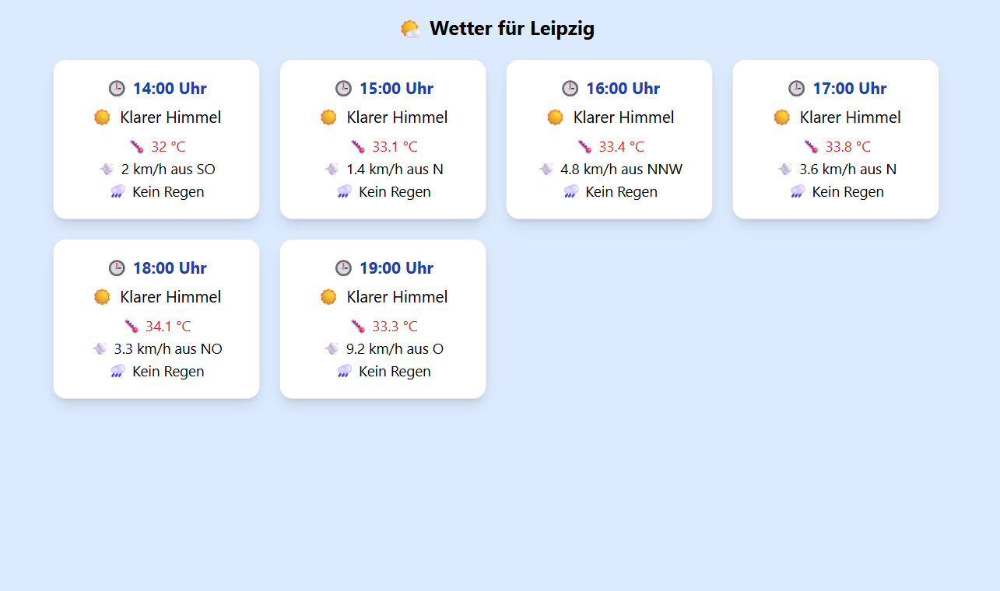

# 🌤️ Wetter Frontend – Kindgerechte Wetteranzeige

Dies ist das Frontend für eine einfache Wetteranwendung, die stündliche Wetterdaten für die nächsten 6 Stunden kindgerecht darstellt – inkl. Emojis, Farben und leicht verständlichen Beschreibungen.

> 💡 Entwickelt mit Vite + React + Tailwind CSS.

---

## 🚀 Features

- Abruf von Wetterdaten über ein separates Backend (`/weather?city=Leipzig`)
- Darstellung von:
  - Temperatur
  - Windrichtung und -geschwindigkeit
  - Niederschlag (verständlich dekodiert)
  - Tageszeit (Unterscheidung zwischen Tag & Nacht)
- Dynamische Darstellung mit Emojis 🧒🌦️
- Responsive Grid-Ansicht für Desktop und Mobilgeräte
- Farbige Visualisierung z. B. nach Tageszeit oder Temperatur (optional)

---

## 📦 Setup

```bash
# Repository klonen
git clone https://github.com/dein-name/wetter-frontend.git
cd wetter-frontend

# Abhängigkeiten installieren
npm install

# Entwicklung starten
npm run dev



```
